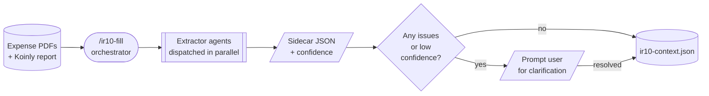
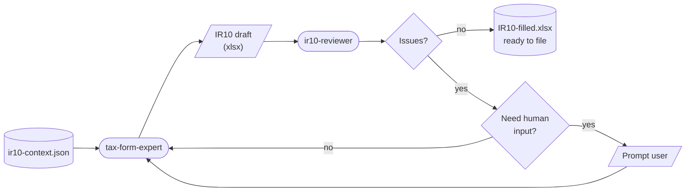

# taxon

**Agentic NZ tax form automation — IR10 and beyond — powered by Claude Code.**

A personal workflow that turns a folder of invoice PDFs and a Koinly crypto report into a filled **IR10 Financial Statements Summary** for Inland Revenue New Zealand. Built for one reason: filing tax should not take a weekend.

---

## Why this exists

Every year the same ritual — open a folder of PDFs, hand-copy totals into a spreadsheet, look up depreciation rates, reconcile the crypto report, cross-check boxes, file. It is slow, error-prone, and the numbers all already exist on the source documents. The goal of this repo is to compress that ritual into a single command while keeping every figure traceable back to a printed number on a source PDF.

Auditability is the hard constraint: no figure is ever guessed, inferred, or silently FX-converted. If the NZD amount is not on the page, the agent asks the user.

---

## How to use

1. **Drop your source documents into a folder.** One folder per tax year works well:
   ```
   ~/tax/2025-26/
     power-bill-april.pdf
     cloud-hosting-q1.pdf
     laptop-Depreciation.pdf      # filename hint → capital asset
     koinly-report-2025.pdf       # filename hint → crypto analyzer
     ...
   ```
   Filename conventions: include `koinly` for crypto reports, and suffix capital assets with `-Depreciation` so they go to the depreciation schedule instead of being expensed.

2. **Open the repo in Claude Code** and run:
   ```
   /ir10-fill ~/tax/2025-26
   ```
   Optionally pass `--template <path-to-existing.xlsx>` to fill an existing workbook instead of generating a fresh one.

3. **Answer the prompts.** The orchestrator will ask for your taxpayer name + IRD number, then batch any clarifying questions (low-confidence extractions, expense category confirmation, depreciation rates for capital items).

4. **Collect the output.** A filled workbook appears at `<your-folder>/IR10-filled.xlsx` alongside a `ir10-context.json` audit trail and `*.extracted.json` sidecars next to each PDF. Open the xlsx, spot-check the figures against the source PDFs, and file.

---

## The workflow

The pipeline runs in two stages, both orchestrated by a single slash command (`/ir10-fill`) at the top of the Claude Code session.

### Stage 1 — Extraction & context generation



The orchestrator classifies every PDF in the expenses folder, then dispatches a fleet of **leaf extractor agents in parallel** — one per document. Each extractor reads exactly one file and returns structured JSON with an explicit confidence level. Results are logged to sidecar files, anomalies surface as questions back to the user, and the final consolidated context is written to `ir10-context.json`.

### Stage 2 — Form filling & review



The consolidated context is handed to `tax-form-expert`, which produces a 3-sheet Excel workbook (`IR10`, `Expenses`, `Depreciation`) driven by `SUMIF` totals and a straight-line depreciation schedule. A separate `ir10-reviewer` agent then validates the workbook against the template spec and the context. Auto-fixable issues loop straight back to the expert; anything else is escalated to the user. The review loop runs for up to 3 iterations before surfacing any remaining issues.

---

## How Claude Code is used (smartly)

This repo is almost entirely Claude Code native — the only Python is a small workbook builder. The intelligence lives in agent definitions, slash commands, and reference guides.

| Feature | How it's used here |
|---|---|
| **Slash commands** | `/ir10-fill <folder>` is the single entry point. It runs at the top of the session because subagents in Claude Code cannot dispatch other subagents — so the orchestration logic lives in the command itself, not in an agent. |
| **Leaf subagents** | Four narrow, single-purpose agents: `expense-extractor`, `koinly-analyzer`, `tax-form-expert`, `ir10-reviewer`. Each has tight tool permissions and a strict "do one thing, return JSON" contract. |
| **Parallel dispatch** | Every PDF extractor is dispatched in a single message so they run concurrently — a folder of 20 invoices finishes in roughly the time of one. |
| **Reference guides** | `guides/IR10_TEMPLATE_STRUCTURE.md` and `guides/IR10_CONTEXT.md` are the single source of truth for sheet layout and box semantics. Both the form-filler and the reviewer read them, so the spec is enforced by construction. |
| **Sidecar JSON** | Every extraction writes a `*.extracted.json` next to the source PDF — a durable audit trail independent of the conversation. |
| **Guardrails in the command** | The orchestrator explicitly refuses to read PDFs itself, invent NZD amounts, or proceed past Stage 1 with unresolved issues. Boundaries are encoded, not implied. |

---

## What the repo currently supports

- **Inputs**: a folder of `.pdf` invoices (any currency, but NZD totals must be printed on the page) and optionally a Koinly crypto tax report.
- **Auto-classification** of source files by filename:
  - `*koinly*.pdf` → routed to `koinly-analyzer` (gains, income, end-of-year holdings).
  - `*depreciation*.pdf` → treated as a **capital asset** and pushed to the depreciation schedule.
  - Everything else → standard expense extraction with an IR10 category hint.
- **IR10 box coverage**: income (2–11), expenses (12–25), profit/tax summary (26–29), fixed assets (30–38), and the low-value asset $1,000 threshold rule (capitalise above, expense below).
- **Koinly → IR10 mapping** baked in: `income_summary_total` → Box 2, `capital_gains_net + other_gains_net` → Box 28, `end_of_year_balances.total_value` → Box 39.
- **3-sheet Excel output** with live `SUMIF` totals and a straight-line depreciation schedule — editable after generation, not a flat dump.
- **Automated review loop** — up to 3 fix/review cycles before the reviewer gives up and surfaces remaining issues.
- **Taxpayer identity is prompted every run** — never stored, never reused across runs.

### Supporting commands

- `/ir10-fill <folder>` — the main pipeline.
- `/extract-expense <pdf>` — run a single invoice through the extractor (useful for debugging).
- `/analyze-koinly <pdf>` — run the Koinly analyzer standalone.
- `/ir10-check-guide` — check whether the local IR10 reference is stale against the latest IRD publication.

---

## What's tested (and what isn't)

The motivation is personal: **fill my own IR10, quickly**. The test surface reflects that.

- **Tested end-to-end** on a real folder containing NZD invoices, a Koinly crypto report, and a capital asset, producing a reviewer-passing workbook.
- **Tested** the parallel extractor dispatch, the sidecar JSON audit trail, and the auto-fix → re-review loop.
- **Tested** the $1,000 low-value asset threshold, straight-line depreciation calc, and `SUMIF`-driven expense rollups.
- **Not tested**: multi-entity filings, IR3/IR4/IR6/IR7 companion forms, GST returns, prior-year comparatives, non-NZD invoices without a printed NZD total (by design — the agent asks the user instead), and obscure IR10 disclosure boxes (52–59).

There is no automated test suite yet — validation is a human running the pipeline and eyeballing the workbook against the PDFs.

---

## What's next

The obvious next step is the **IR3 companion return** — the IR10 is a summary that gets filed alongside an income tax return anyway, so extending the same pipeline to produce a matching IR3 closes the loop for an individual filing. Everything else (GST, prior-year carry-forward, bank statement ingestion) is nice-to-have and will only get built if a real filing needs it.

---

## Repo layout

```
.claude/
  agents/            # four leaf subagents (extractor, koinly, form-expert, reviewer)
  commands/          # slash commands — /ir10-fill is the orchestrator
guides/
  IR10_TEMPLATE_STRUCTURE.md   # authoritative 3-sheet workbook spec
  IR10_CONTEXT.md              # box-by-box semantics
scripts/
  build_ir10.py      # workbook generator (openpyxl only)
CLAUDE.md            # working preferences for Claude Code in this repo
```

---

## Status

Personal project. Not distributed, not a tax service, not a substitute for a chartered accountant. If you use it, verify every figure against the source PDFs before filing.
